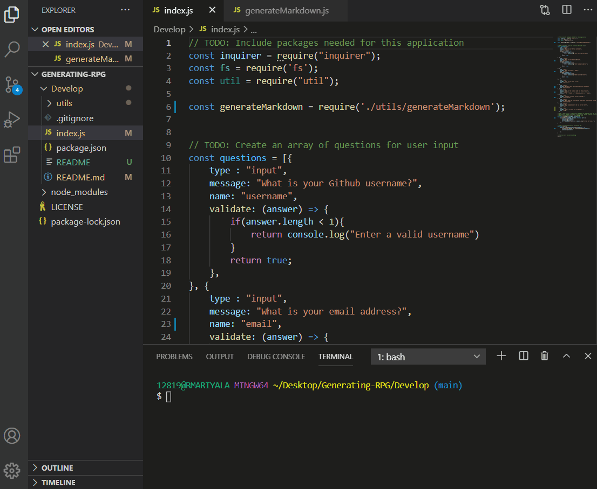

# Generating-RPG

### User Story

Part of being a developer is putting yourself in the shoes of 
your audience and imagining their experience with the application 
you’re creating. 

A user story, or persona, is a description of an application using 
natural, non-technical language. Written from the perspective of the 
application’s end user, they help developers organize their work by 
allowing them to understand an application’s context and who will be 
using it.

[Deployed link](https://ramyamariyala.github.io/Generating-RPG/)

[Github repo](https://github.com/Ramyamariyala/Generating-RPG.git)

## Contact Information
 * Name :Ramya Mariyala
 * Email: ramya.mariyala@gmail.com
